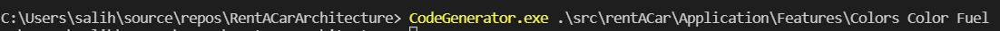
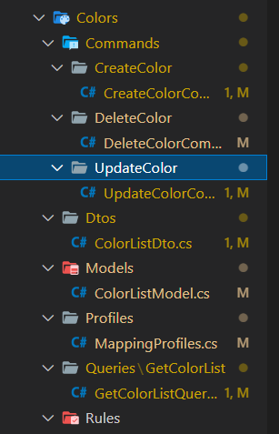
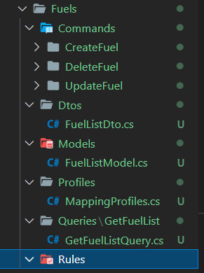
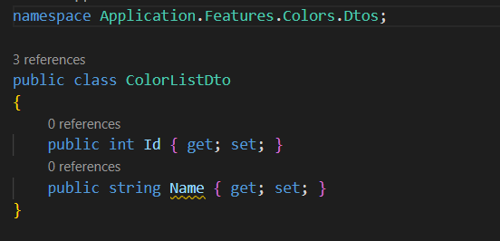
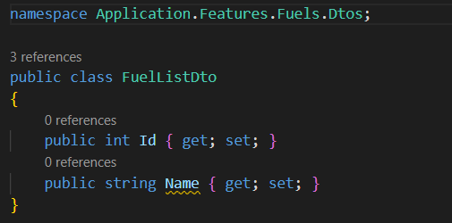

# MyCodeGenerator
My first basic level code generator

#For the file;

Creates a new file by replacing the first word and second word you provide for the file path and content.

#For the folder;

It creates a new folder/file by replacing the path of all subfolders in the folder, all file path and contents with the first word you give for the second word.

# Using
CodeGenerator.exe <input_file> <input_srcStr> <output_destStr>

 

